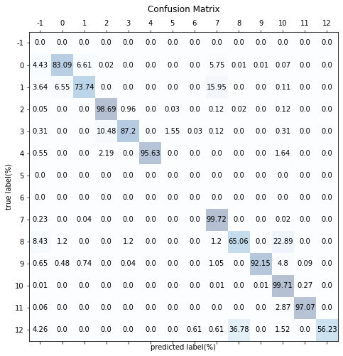

# scClass: A immune cell classifier tool created by supervised deep learning

## Abstract
Single-cell RNA sequencing(scRNA-seq) is a novel RNA seqensing method which can track their RNA-expression in every single cell. 
However, the traditional way to annotate cell-type like isolate by flow cytometry or clustering by seurat is either expensive or inefficient.
Here we present scClass, a supervised deep learning model for annotating celltype on immmune cell.
scClass use bone marrow and cord blood dataset to training and try to predict on pbmc and other dataset.
We provide a package for running scClass on Python and have a demo on [Colab]().

## Introduction
Cell type annotation is one of the most important step in Single-cell RNA sequencing analysing.
There are many annotation tools which can found on scRNA-tools nowadays.
As the amount of cells in one scRNA-seq study grow up immediately,
but most scRNA-tools aren't optimized, so that it cost more memory and computation.
In our demo, we classify around 140,000 cells but use only 12GB moemory on Colab.

## Data and Model

### Dataset and Data-Preprocessing
We collect 10X genomics datasets since it is a popularization scRNA-seq method.
Using bone marrow and cord blood dataset to training and try to predict on pbmc and other dataset. 
We use algothithn from librarySizeFactors and computeSumFactors function on scran(R package) and implemented by scanpy function. 
We transfer cell type refer to [Cell Ontology](https://www.ebi.ac.uk/ols/ontologies/cl).

  <kbd></kbd> 
  ▲ Data-Preprocessing

  

### scClass Model
First, the transcriptome needs to transfer the gene axis to match the model.
Then go throught a linear-layer and select the arg maximum of output.
The model is implemented by PyTorch.
We can pick unknown cell by the output are less prominent. 
To adpate each dataset,  we add standard normalize for each channel after output and pick the maximum output upper 1.6~2.0(different by each label) to unknow label.

## Rseult: compare to origin dataset

  
| | | |
|:-:|:-:|:-:|
| CordBlood and BoneMarrow dataset | PBMC dataset | |
  

## Conclusion
We present a immune cell classifier tool created scClass based on supervised deep learning.
scClass is a package that can use in Python.
We except the model has higher accuracy of adapted in our future version.
The source code is available at https://github.com/majaja068/scRNA-CellType-classifier/
